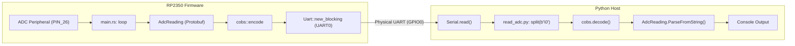

[](https://deepwiki.com/plops/rp2350-cobs-proto)

# RP2350 ADC Protobuf & COBS System

A complete end-to-end template for high-performance data acquisition and telemetry between an **RP2350 (Cortex-M33)** microcontroller and a host computer. The system utilizes modern asynchronous Rust firmware to sample analog signals, serialized using **Protocol Buffers (Protobuf)** and framed via **Consistent Overhead Byte Stuffing (COBS)** for robust transmission over UART.

## System Architecture

The project consists of two primary components communicating over a serial link:

### Embedded Firmware (Rust)
- **Runtime**: `embassy-executor` async runtime
- **Sampling**: Reads raw values from `ADC0` on `PIN_26`
- **Serialization**: Packs data into `AdcReading` Protobuf message
- **Framing**: Applies COBS encoding with `0x00` byte delimiters
- **Transmission**: Sends via UART0 at 115,200 baud

### Host Receiver (Python)
- **Management**: CLI tool managed by `uv`
- **Synchronization**: Scans for `0x00` COBS delimiters
- **Decoding**: Unstuffs COBS frames to recover Protobuf payload
- **Parsing**: Deserializes bytes into Python objects for display



## Project Structure

| Path | Purpose |
|:---|:---|
| `src/` | Rust firmware source code, main loop, and Protobuf schema |
| `host/` | Python receiver script, Protobuf definitions, and `pyproject.toml` |
| `.cargo/` | Toolchain configuration for `thumbv8m.main-none-eabihf` target |
| `scripts/` | Automation for semantic versioning and release tagging |
| `.github/` | CI/CD workflows for automated builds and remote debugging |

## Quick Start

### Prerequisites
- Rust toolchain with `thumbv8m.main-none-eabihf` target
- `flip-link` linker for memory safety
- `uv` Python package manager

### Firmware Setup

```bash
# Add target architecture
rustup target add thumbv8m.main-none-eabihf

# Install flip-link for stack protection
cargo install flip-link

# Build firmware
cargo build --release
```

The compiled binary is located at `target/thumbv8m.main-none-eabihf/release/rp2350-adc-protobuf`.

### Flashing the Firmware

```bash
# Using probe-rs or picotool
cargo run --release
```

### Host Receiver Setup

```bash
cd host

# View usage options
uv run python read_adc.py --help

# Run receiver (auto-detects serial ports)
uv run python read_adc.py
```

## Data Pipeline

The system uses a strict serialization-framing-delimitation sequence for data integrity:

1. **ADC Sampling**: Raw voltage readings from `PIN_26`
2. **Protobuf Serialization**: Data packed into `AdcReading` message with timestamp and voltage fields
3. **COBS Framing**: Encoded with consistent overhead byte stuffing
4. **UART Transmission**: Sent at 115,200 baud with `0x00` delimiters
5. **Host Decoding**: Python receiver unstuffs COBS, parses Protobuf, displays data

## CI/CD Pipeline

The GitHub Actions workflow (`.github/workflows/build.yml`) automatically:

- Builds firmware for `thumbv8m.main-none-eabihf` target
- Uploads build artifacts to Actions UI
- Creates GitHub Releases with compiled binaries on version tags
- Provides interactive SSH debugging via `tmate` on failure or manual trigger

### Triggering the Workflow

1. **Push/PR**: Automatic on `main` or `master` branches
2. **Release Tags**: Triggered by `scripts/release.sh`
3. **Manual Dispatch**: Via GitHub Actions UI

### SSH Debugging

On build failure or manual trigger, a `tmate` session provides SSH access to the build server for interactive debugging (limited to the workflow triggerer).

## Release Process

Automated release management via `scripts/release.sh`:

```bash
# Create release (validates semver, updates Cargo.toml, creates tag)
./scripts/release.sh 0.1.0

# Push to trigger GitHub release build
git push origin main --tags
```

The script:
- Validates version format (semver)
- Checks for uncommitted changes
- Updates `Cargo.toml` version
- Runs `cargo check` for target
- Creates git tag
- Commits version bump

## Technical Details

- **Target**: RP2350 (Cortex-M33) with `thumbv8m.main-none-eabihf` triple
- **Memory Layout**: 4MB Flash at `0x10000000`, 520KB SRAM at `0x20000000`
- **UART Configuration**: UART0 on GPIO0 (TX) at 115,200 baud
- **Protobuf Schema**: Defines `AdcReading` message with `adc_raw`, `timestamp_ms`, and `voltage` fields
- **COBS Encoding**: Ensures frame boundaries with `0x00` byte delimiters for robust serial transmission


